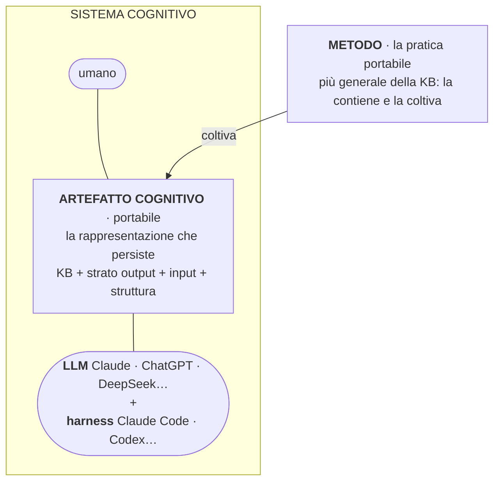
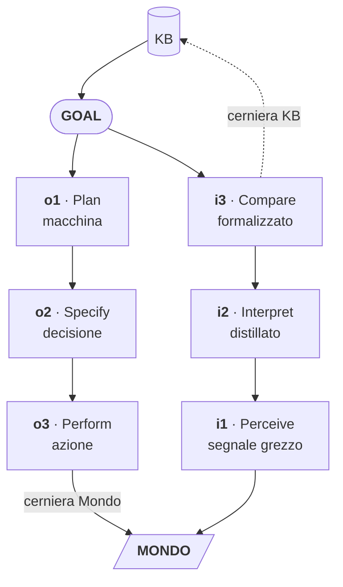
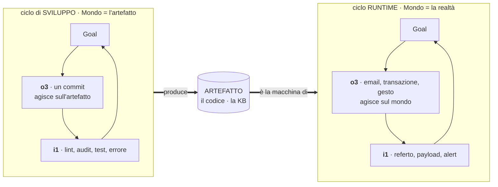
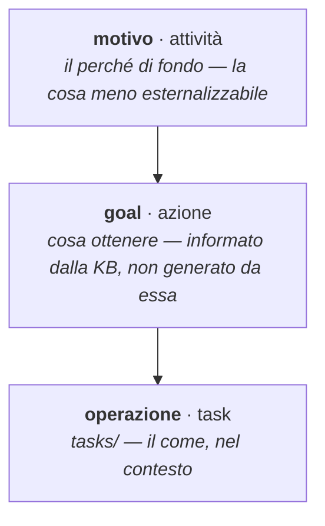
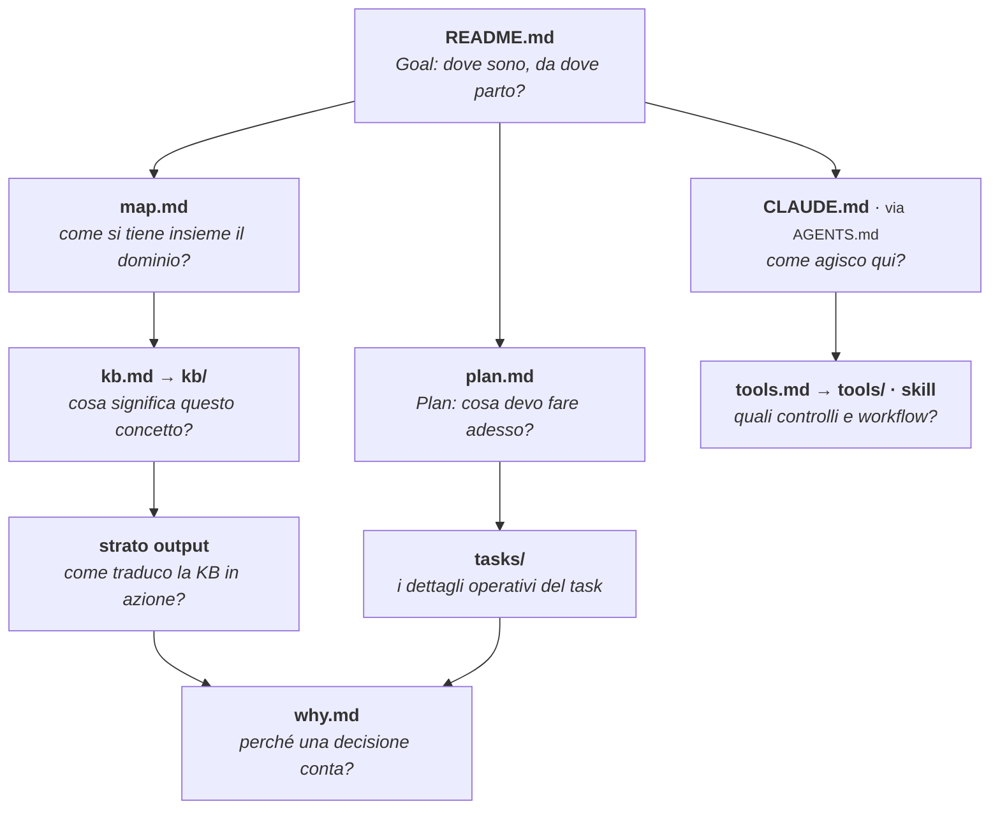
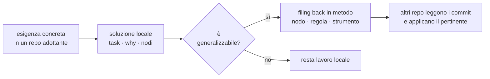
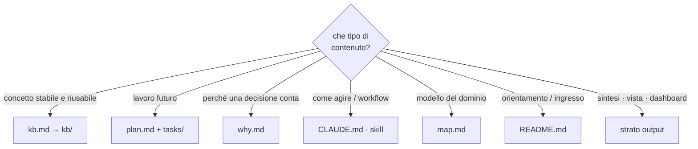

Questa è la vista d'insieme del **metodo KB**: il metodo per costruire e mantenere _knowledge base_ — basi di conoscenza personali e professionali, da qui in poi «KB» — insieme a un modello linguistico (LLM).

I diagrammi comprimono il metodo intero e si leggono dall'alto in basso: _cosa è_ l'oggetto che si coltiva, _come_ funziona (i tre giganti, il ciclo dell'azione, il goal), _come cresce_ nel tempo. Ognuno è una porta: il dettaglio vive nei nodi della KB linkati in fondo.

Questo documento non è un nodo della KB ma una sua sintesi — e per la disciplina zettelkastiana le sintesi vivono fuori dai nodi atomici, in uno strato dedicato. Cosa sia quello strato, e perché questa pagina ne sia un esempio, si chiarisce più avanti.

## Cosa è: artefatto, sistema, metodo

La knowledge base non è il metodo: il metodo è più generale e la contiene. Tre parole per tre cose distinte, a lungo confuse nella sineddoche "KB = metodo".

- L'**artefatto cognitivo** è la rappresentazione esterna che persiste e si progetta — KB + strato output + input + struttura. È _portabile_: sopravvive al cambio di modello o di harness. È ciò che si coltiva.
- Il **sistema cognitivo** è dove la cognizione accade davvero: l'artefatto accoppiato all'umano e all'LLM (col suo harness), in opera — il _caso saliente_ di una popolazione di agenti più ampia. Non si progetta come oggetto: emerge dall'uso, e non è portabile.
- Il **metodo** è la pratica con cui si coltiva l'artefatto perché il sistema performi.

LLM e harness sono cose diverse: l'**LLM** è il modello (Claude, ChatGPT, DeepSeek…), l'**harness** è lo strumento che lo mette al lavoro (Claude Code, Codex…). La tesi del progetto — _artefatto portabile, vendor-neutro_ — è dicibile solo perché l'artefatto è la rappresentazione, non il sistema d'interazione: cambi modello e harness, l'artefatto resta.

## I tre giganti

Sotto l'ontologia, tre pilastri si dividono il lavoro in modo nitido: come è fatto il nodo, chi tiene aggiornato il sistema, come il sistema produce azione. Luhmann _è_ la KB — Karpathy la _governa_ — Norman la _connette al mondo_.

Karpathy risolve il "chi mantiene" che Luhmann non affronta; Norman risolve il "come l'utente agisce" che né Luhmann né Karpathy affrontano.

## Il ciclo dell'azione

La KB non è il fine: è strumentale all'azione. Il ciclo è quello di Norman, nella sua forma originale: il **Goal** in cima (la KB è la memoria all'apice), il **Mondo** in fondo, l'esecuzione che scende a sinistra (Plan → Specify → Perform) e la valutazione che risale a destra (Perceive → Interpret → Compare).

Le due cerniere hanno la stessa forma — _scrivi-poi-leggi attraverso un medium_: al **Mondo** o3 scrive un effetto e i1 lo rilegge più tardi (il mondo trattiene lo stato); alla **KB** i3 scrive l'esito e il Goal vi legge l'intenzione. L'unica vera asimmetria non è tra le cerniere ma tra i medium: il mondo persiste da sé, la KB solo se scritta — per questo una decisione non scritta è persa. È qui che il metodo estende Norman ai suoi due estremi: apre il confine-Mondo (il mondo agisce, non solo risponde) e il confine-Goal (il goal si forma, non è dato).

## Cicli annidati: due Mondi

Il ciclo non è uno solo: sono due, annidati, ciascuno lo specchio appena visto. Si distinguono per _cosa è il loro Mondo_ in fondo.

Per questo o1/o2/o3 e i1/i2/i3 si **raddoppiano**: c'è un o3 che agisce sul mondo e uno che agisce sull'artefatto, un i1 che viene dal mondo e uno che viene dall'artefatto. L'incastro è che l'**o3 del ciclo di sviluppo è la macchina del ciclo runtime** — il commit produce il codice che gira. Risalire da un output al task che l'ha generato — `output → codice → commit → tasks → goal` — è attraversare l'annidamento; `git-history`, `why` e `tasks` ne registrano la traccia. È il senso in cui il metodo apre la scatola nera che Norman lasciava chiusa: ogni sistema è l'o3 di un ciclo che lo precede.

## Le quattro dimensioni

«Dividere gli stadi per agente» sarebbe un taglio rigido: nasconde che agente e livello sono cose diverse — l'errore che aveva fatto «sparire» o1. Ogni elemento del metodo si colloca invece su quattro dimensioni _ortogonali_. E l'agente stesso non è un binario ma una popolazione — Norman: «person, animal, or machine» —: il binomio umano/LLM è il caso saliente, con la macchina che varia per capacità (un LLM di frontiera che pianifica, un agente locale che esegue).

| dimensione          | valori                                           |
| ------------------- | ------------------------------------------------ |
| **agente**          | umano · LLM _(caso saliente di una popolazione)_ |
| **annidamento**     | runtime (→ mondo) · sviluppo (→ artefatto)       |
| **livello**         | 1 macchina · 2 decisione · 3 azione              |
| **lato del cappio** | output (esecuzione) · input (valutazione)        |

La matrice è la lente per confrontare i domini. Qualche elemento collocato: il `.nix` di `nixos` è {LLM, sviluppo, livello 1, output}; un referto in `salute` è {umano, runtime, livello 1, input}; il termometro del `quadro` è {umano, runtime, livello 2, output}; un test che fallisce è {LLM, sviluppo, livello 1, input}. Letta per dominio dice cosa è sviluppato, cosa manca perché non serve (`nixos` ha pochissimo input esogeno dal mondo), e cosa manca ma servirebbe.

## Il goal: tre altitudini, un confine aperto

Norman dà il Goal per scontato. Il metodo lo disciplina con la gerarchia dell'activity theory (Leontiev): `goal` / `task` / `tasks/` non sono sinonimi, sono tre altitudini.

La KB _informa e raffina_ il Goal, non lo _genera_: il Goal nasce all'incrocio tra motivo (da sopra) e KB. Da qui i due modi di i3: **verdetto** (Compare contro un goal esistente — loop noto, delegabile) e **formazione del goal** (triage dell'esogeno, decidere cosa conta — la cosa meno esternalizzabile, eco delle ironie dell'automazione di Bainbridge).

## Anatomia di un progetto

La struttura replicabile non è un albero identico: è la presenza esplicita delle funzioni cognitive. La **root è l'atrio dell'artefatto**: l'`ls` ne dichiara l'inventario completo. Due specie di file — i _file-ciclo_ (README, map, plan, why, CLAUDE/AGENTS) letti a ogni sessione, e le _porte-collezione_ (`kb.md`, `tools.md`, `presentations.md`, `sources.md`) viste sempre ma aperte on-demand. La collocazione segue la funzione + pace, non la profondità: `plan` e `why` stanno in root pur cambiando in fretta perché la loro altezza lo impone. Ogni componente risponde a una domanda. (`AGENTS.md` non è una funzione a sé: è il wrapper sottile, agnostico rispetto all'agente, che instrada verso README e CLAUDE.)

## Sviluppo del metodo: dal basso e dall'alto

Il metodo cresce per due movimenti in alternanza. Dal basso emerge dall'uso reale: un'esigenza concreta in un repo adottante si stabilizza e risale solo se generalizzabile (il diagramma sotto). Dall'alto una cornice teorica importata dà forma a ciò che dal basso si avverte ma non si sa nominare. Il dal-basso è la guardia contro la sovra-ingegnerizzazione; `metodo` custodisce le generalizzazioni, non orchestra i repo.

## Dove vive cosa

La regola di routing che tiene puliti i confini tra i componenti.

## Lo strato output di questo repo

Dichiarazione minima dello strato output del repo `metodo`, applicata a sé stesso:

- **o1 macchina**: `kb/` in markdown consumato dagli LLM via symlink; output di `tools/kb_tools.py` (audit JSON/markdown)
- **o2 decisione**: questo file — i diagrammi del metodo in sintesi
- **o3 azione**: il metodo applicato nei quattro repo adottanti (nodi creati, commit, KB mantenute)
- **i1 grezzo**: osservazioni dai repo adottanti (commit, task, why) e fonti in `sources/` (i libri di Norman, Hutchins, Leontiev)
- **i3 di ritorno**: l'osservatorio rilegge i repo adottanti e aggiorna `kb/confronto-progetti-adottanti.md`
- **Criterio di aggiornamento**: quando un gigante, un livello, un componente o un concetto fondativo cambia nei nodi, qui si aggiorna il diagramma corrispondente

## L'o2 è lo stadio Compare del metodo su sé stesso

Ecco perché questa pagina è un esempio dello strato che descrive. L'o2 non è solo un prodotto: è l'**organo di valutazione** del metodo. Nel ciclo dell'azione il Compare (i3) confronta lo stato con il goal; cristallizzato come artefatto, quel confronto _è_ l'o2 — il termometro del ciclo di **sviluppo**, simmetrico a `plan.md`, che ne è lo stadio Plan.

Funziona per una proprietà dei nodi: sono atomici e _localmente_ coerenti (Luhmann), e una contraddizione che vive _tra_ due nodi è invisibile da dentro ciascuno. Comprimere il metodo intero in pochi diagrammi costringe alla co-presenza e fa affiorare le tensioni _non-locali_. Da qui la disciplina — **l'o2 rivela, i nodi risolvono**: ogni tensione trovata si chiude _giù_ nei nodi (la fonte di verità), poi l'o2 si _ri-deriva_. Aggiornare questa pagina non è rifinirla: è far girare lo stadio Compare del metodo su sé stesso — come questa stessa revisione, derivata dal de-cablaggio appena chiuso nei nodi.

## Approfondimento

I diagrammi comprimono; i nodi spiegano.

- cosa è (artefatto / sistema / metodo) → `kb/artefatto-cognitivo.md`, `kb/sistema-cognitivo.md`
- tre giganti → `kb/ciclo-azione.md`, `kb/zettelkasten.md`, `kb/pattern-karpathy.md`
- il ciclo · specchio simmetrico · cicli annidati · quattro dimensioni → `kb/ciclo-azione.md`, `kb/output.md`
- l'agente come popolazione · system image condivisa → `kb/agente.md`, `kb/system-image.md`, `kb/affordance-signifier.md`, `kb/visceral-behavioral-reflective.md`
- il goal · tre altitudini → `kb/goal.md`
- anatomia del progetto → `kb/struttura-progetto.md`
- sviluppo del metodo (due movimenti) e osservatorio → `kb/sviluppo-metodo.md`, `kb/osservatorio-metodo.md`, `kb/metodo-kb.md`
- dove vive cosa → `kb/metodo-kb.md` (regole sullo stato), `kb/zettelkasten.md` (regola pratica)
