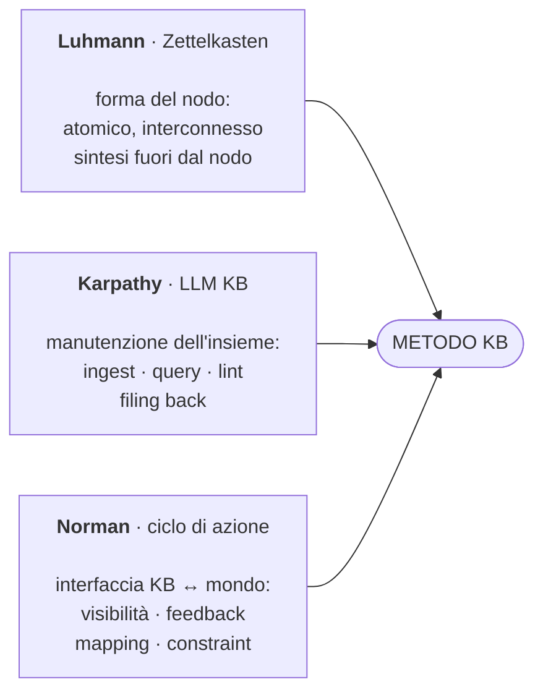
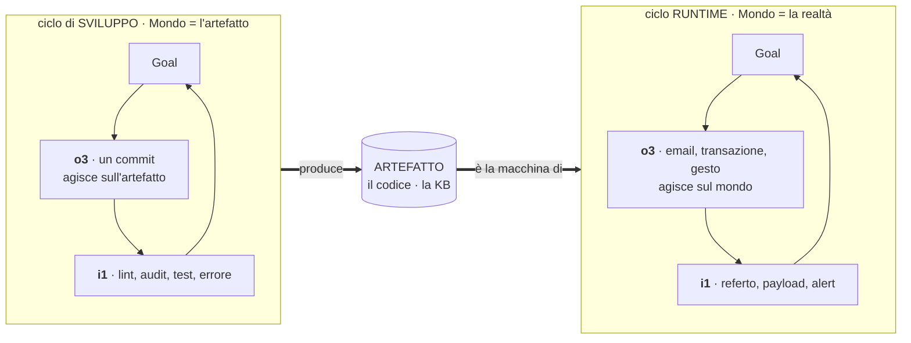
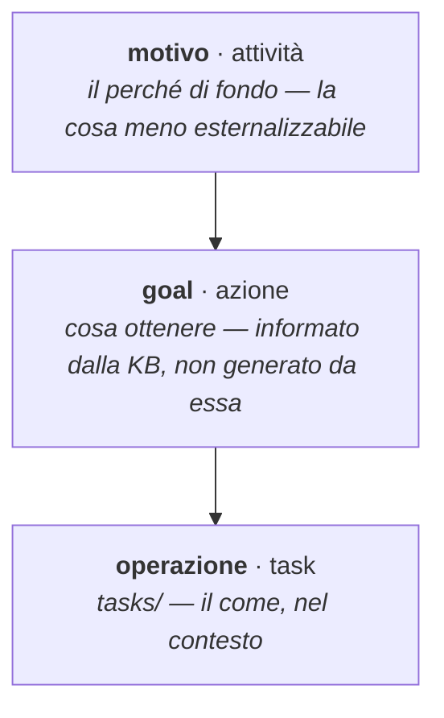
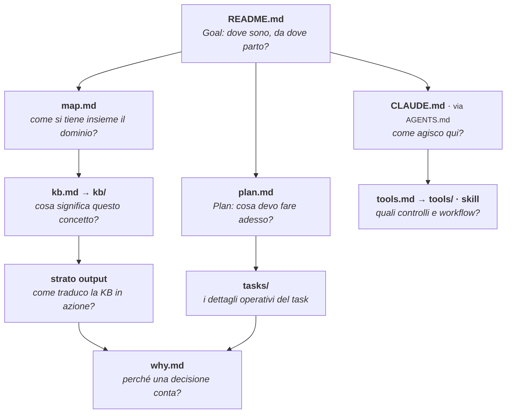
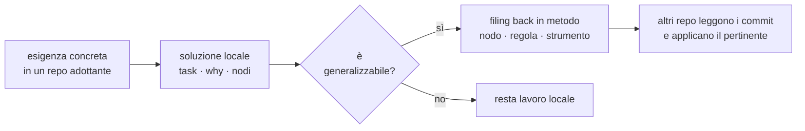
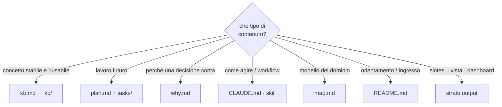

Vista d'insieme del **metodo KB**: costruire e mantenere _knowledge base_ — personali e professionali — insieme a un LLM. I diagrammi comprimono; il dettaglio vive nei nodi linkati in fondo.

Questo non è un nodo della KB ma una sua **sintesi** — e per la disciplina zettelkastiana le sintesi vivono fuori dai nodi atomici, in uno strato dedicato. Perché questa pagina ne sia un esempio si chiarisce all'ultima slide.

## Cosa è: artefatto, sistema, metodo

La KB non è il metodo: il metodo la contiene. Tre parole per tre cose, a lungo confuse nella sineddoche «KB = metodo».

- **Artefatto** — la rappresentazione che persiste e si progetta; _portabile_, sopravvive al cambio di modello o harness.
- **Sistema** — l'artefatto in opera, accoppiato a umano e LLM: dove la cognizione accade. Emerge dall'uso, non è portabile.
- **Metodo** — la pratica con cui si coltiva l'artefatto perché il sistema performi.

L'artefatto resta vendor-neutro perché è la _rappresentazione_, non il sistema d'interazione (LLM e harness sono diversi e sostituibili).

## I tre giganti

Luhmann _è_ la KB (forma del nodo), Karpathy la _governa_ (manutenzione), Norman la _connette al mondo_ (azione).

Karpathy risolve il «chi mantiene» assente in Luhmann; Norman il «come l'utente agisce» assente in entrambi.

## Il ciclo dell'azione: 6 atti + 2 poli

La KB non è il fine: è strumentale all'azione. Il ciclo di Norman, riletto: ai vertici due **poli** — il **Goal** (apice, il motivo) e il **Mondo** (fondo) — e fra loro sei **atti**, l'esecuzione che scende e la valutazione che risale.

I poli non si eseguono: si _costituiscono_ ai bordi. Il Mondo non preesiste — lo ritaglia l'artefatto, dall'infinito, per rilevanza guidata dai goal.

## Le due cerniere: l'asimmetria è tra i medium

Le due cerniere hanno la stessa forma — _scrivi-poi-leggi attraverso un medium_: al Mondo o3 scrive un effetto e i1 lo rilegge (il mondo trattiene lo stato); alla KB i3 scrive l'esito e il Goal lo legge.

L'unica vera asimmetria è **tra i medium**: il mondo persiste da sé, la KB solo se qualcuno la scrive. Da qui «una decisione non scritta è persa», e la ragione per cui la KB ha bisogno di un custode.

È dove il metodo estende Norman ai due estremi: il Mondo _agisce_ (non solo risponde), il Goal _si forma_ (non è dato).

## I tre livelli: perché un o2 solo riflessivo non muove

I tre livelli di Norman stratificano il ciclo per altezza: **riflessivo** in alto (la KB — pensa, non agisce direttamente), **behavioral** in mezzo (o2/i2 — l'operare), **viscerale** al Mondo (o3/i1 — giudizio sensoriale rapido e gesto).

Conseguenza per il design: il riflessivo può solo _condizionare_ l'azione, attraverso l'output. Per muovere davvero, l'o2 deve raggiungere il **viscerale** — apparenza, impatto immediato, affetto. Un o2 solo riflessivo (testo, schemi) sa ma non muove: è la stasi. «Attractive things work better» non è estetica, è la condizione perché il sapere arrivi al gesto.

## Cicli annidati: due Mondi

Due cicli annidati, distinti da _cosa è il loro Mondo_ in fondo.

L'o3 di sviluppo è la macchina del runtime — il commit produce il codice che gira. Per questo il metodo apre la scatola nera di Norman: ogni sistema è l'o3 di un ciclo che lo precede.

## Le quattro dimensioni

Agente e livello sono cose diverse — confonderli aveva fatto «sparire» o1. Ogni elemento sta su quattro dimensioni _ortogonali_.

| dimensione          | valori                                           |
| ------------------- | ------------------------------------------------ |
| **agente**          | umano · LLM _(caso saliente di una popolazione)_ |
| **annidamento**     | runtime (→ mondo) · sviluppo (→ artefatto)       |
| **livello**         | 1 macchina · 2 decisione · 3 azione              |
| **lato del cappio** | output (esecuzione) · input (valutazione)        |

La matrice è la lente per confrontare i domini: cosa è sviluppato, cosa manca perché non serve, cosa manca ma servirebbe.

## Il goal: tre altitudini, un confine aperto

Norman dà il Goal per scontato; il metodo lo disciplina con Leontiev: `goal` / `task` / `tasks/` sono tre altitudini.

La KB _informa_ il Goal, non lo _genera_: nasce all'incrocio motivo × KB. Da qui i due modi di i3 — **verdetto** (Compare su goal noto, delegabile) e **formazione del goal** (triage dell'esogeno, la cosa meno esternalizzabile).

## La matrice di verifica: contro l'auto-accondiscendenza

La simmetria a 8 elementi non si dà per scontata: si mette alla prova. Gli 8 elementi × 5 artefatti, verdetto **solido / debole / forzato**.

Il rischio è la complicità con sé stessi — chi cerca simmetria la trova. Primo passaggio onesto: i venti S di bordo sono quasi tautologici (li definiamo noi), l'interno è debole o da verificare, e lo zero-forzati è sospetto perché le caselle dure (i2/i3) sono ancora vuote.

Lo strumento serve a _falsificare_ la teoria, non a incoronarla.

## Anatomia di un progetto

La struttura replicabile non è un albero identico: è la presenza esplicita delle funzioni cognitive. La root è l'**atrio** — l'`ls` ne dichiara l'inventario. Due specie: _file-ciclo_ (letti ogni sessione) e _porte-collezione_ (viste, aperte on-demand). La collocazione segue funzione + pace, non profondità.

## Sviluppo del metodo: dal basso e dall'alto

Due movimenti in alternanza. Dal basso: un'esigenza concreta risale a `metodo` solo se generalizzabile — la guardia contro la sovra-ingegnerizzazione. Dall'alto: una cornice teorica importata dà forma a ciò che dal basso si avverte ma non si sa nominare. `metodo` custodisce le generalizzazioni, non orchestra i repo.

## Dove vive cosa

La regola di routing che tiene puliti i confini tra i componenti.

## Lo strato output di questo repo

Dichiarazione minima, applicata a sé stessa:

- **o1 macchina**: `kb/` in markdown via symlink; output di `tools/kb_tools.py`
- **o2 decisione**: _questo deck_ (Reveal sulla sorgente `metodo-in-sintesi.md`) — e la forma segue la domanda: deck per la sintesi che si scorre, ma il repertorio o2 è più largo (pagina, tabella, grafico, canvas)
- **o3 azione**: il metodo applicato nei repo adottanti (nodi, commit, KB mantenute)
- **i1/i3 di ritorno**: osservazioni dai repo → `confronto-progetti-adottanti`

La pubblicazione (o3) si serve dalla sorgente, per un percorso versionato, dietro confine di rete (cfr. `presentazione`).

## L'o2 è lo stadio Compare del metodo su sé stesso

Ecco perché questa pagina è un esempio dello strato che descrive. L'o2 non è solo un prodotto: è l'**organo di valutazione**. Cristallizzato, il Compare (i3) _è_ l'o2 — il termometro del ciclo di sviluppo, simmetrico a `plan.md`, che ne è lo stadio Plan.

I nodi sono atomici e _localmente_ coerenti (Luhmann): una contraddizione che vive _tra_ due nodi è invisibile da dentro ciascuno. Comprimere il metodo in pochi diagrammi forza la co-presenza e fa affiorare le tensioni _non-locali_. Disciplina: **l'o2 rivela, i nodi risolvono** — ogni tensione si chiude giù nei nodi (la fonte di verità), poi l'o2 si _ri-deriva_. Aggiornare questa pagina è far girare lo stadio Compare del metodo su sé stesso — come questa stessa revisione.

## Approfondimento

I diagrammi comprimono; i nodi spiegano.

- cosa è (artefatto / sistema / metodo) → `kb/artefatto-cognitivo.md`, `kb/sistema-cognitivo.md`
- tre giganti → `kb/ciclo-azione.md`, `kb/zettelkasten.md`, `kb/pattern-karpathy.md`
- ciclo (6 atti + 2 poli) · cerniere e asimmetria dei medium · cicli annidati · quattro dimensioni → `kb/ciclo-azione.md`, `kb/mondo.md`, `kb/output.md`
- i tre livelli · system image · agente come popolazione → `kb/visceral-behavioral-reflective.md`, `kb/system-image.md`, `kb/affordance-signifier.md`, `kb/agente.md`
- il goal · tre altitudini → `kb/goal.md`
- la matrice di verifica → `kb/matrice-ciclo-azione.md`
- strato output · repertorio o2 · pubblicazione → `kb/output.md`, `kb/presentazione.md`
- anatomia del progetto → `kb/struttura-progetto.md`
- sviluppo del metodo e osservatorio → `kb/sviluppo-metodo.md`, `kb/osservatorio-metodo.md`, `kb/metodo-kb.md`
- dove vive cosa → `kb/metodo-kb.md`, `kb/zettelkasten.md`
