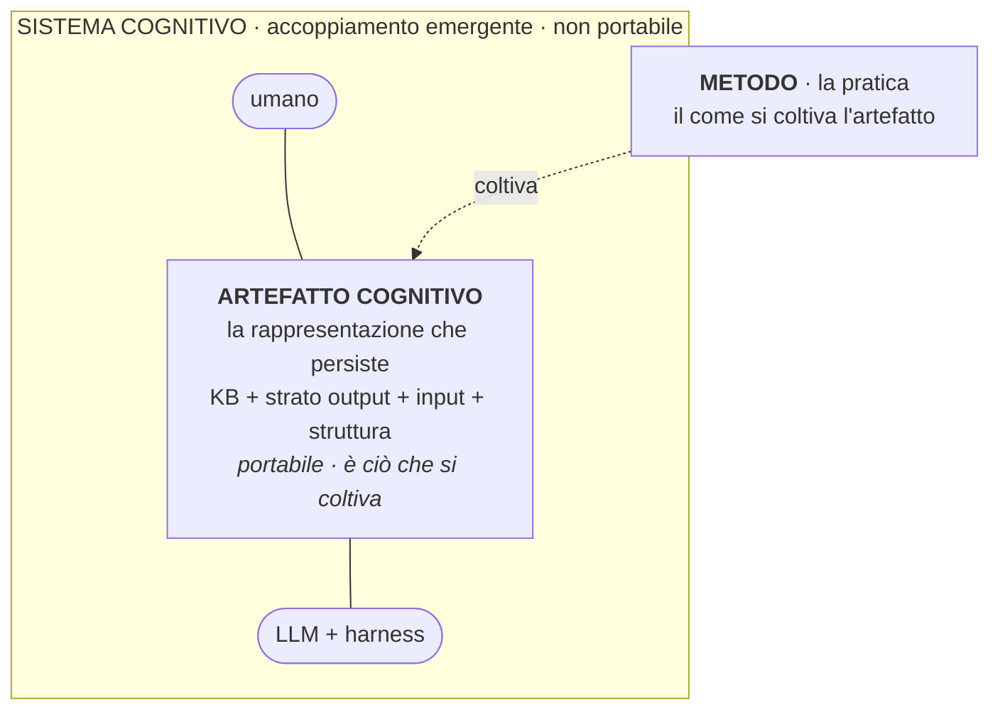
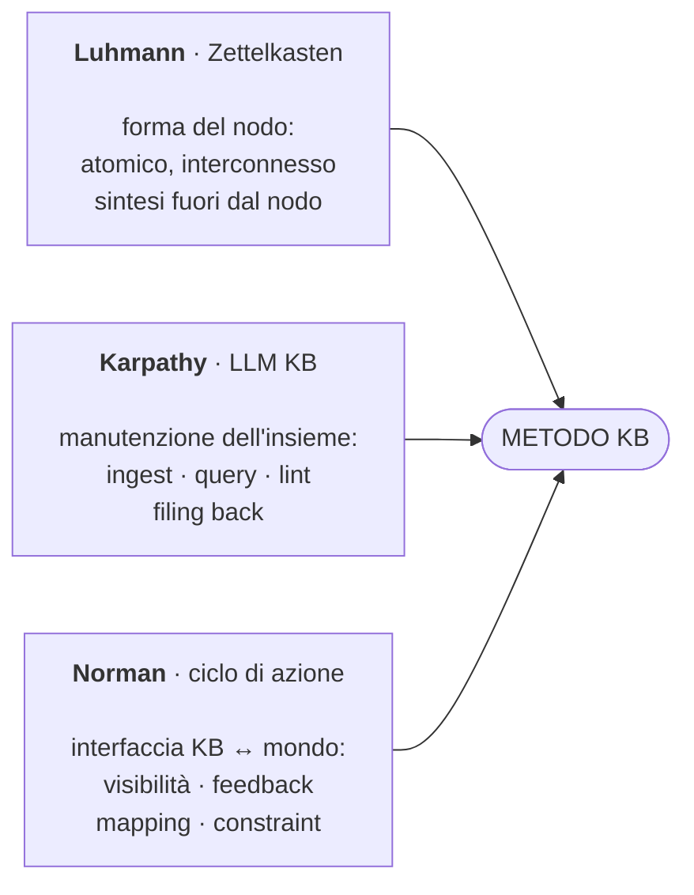
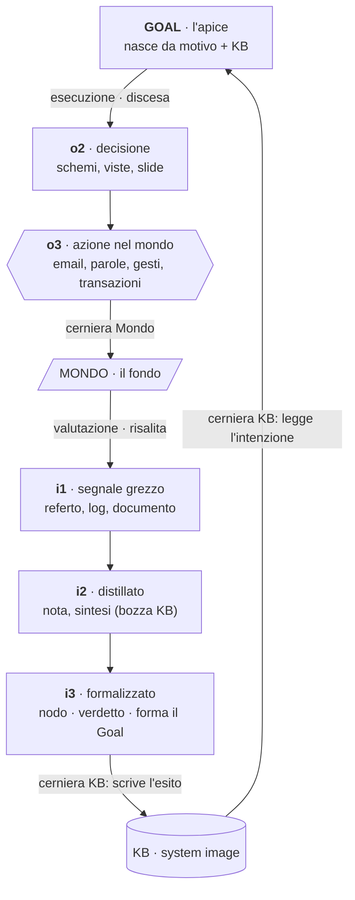
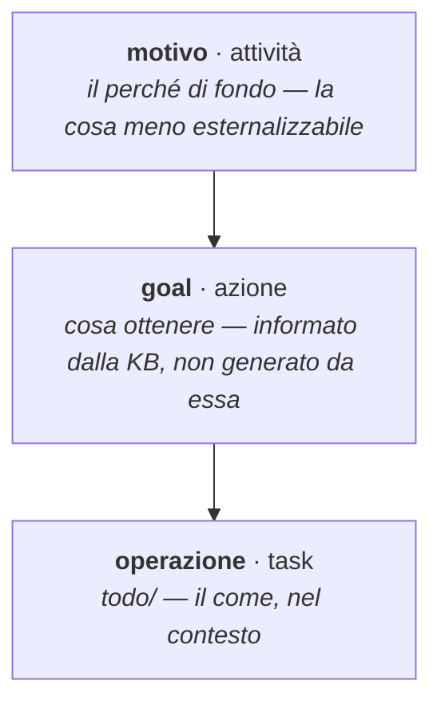
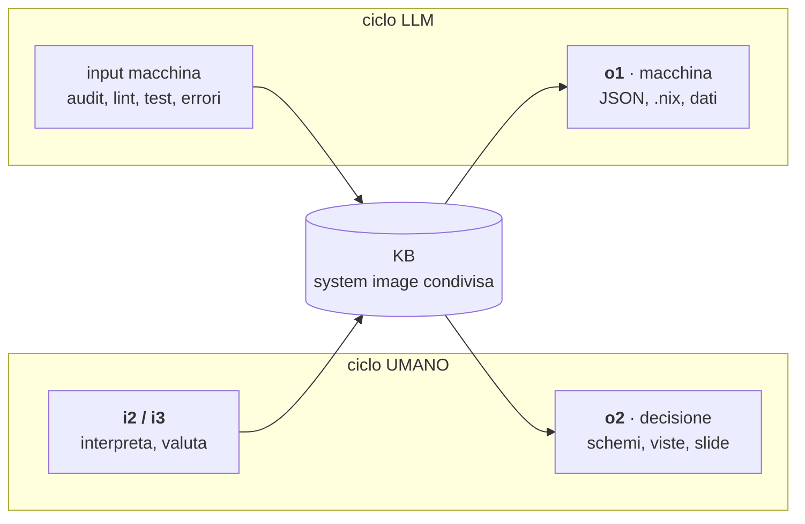
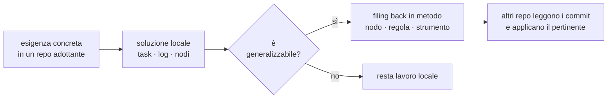
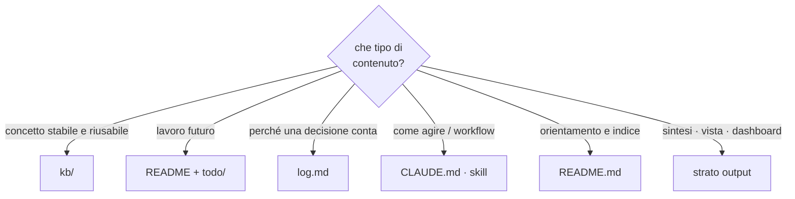

Strato output (o2) del repo `metodo`: la vista d'insieme leggibile a colpo d'occhio del metodo KB. Non è un nodo della KB — è la sintesi che, per la disciplina zettelkastiana, vive nello strato output e non nei nodi atomici. I diagrammi reggono il metodo intero; il dettaglio sta nei nodi linkati in fondo.

L'arco va dall'alto al basso: *cosa è* l'oggetto che si coltiva (ontologia), *come* funziona (i tre giganti, il ciclo, i due agenti, il goal), *come cresce* (anatomia, bottom-up, routing). Lo strato concettuale superiore (tripartizione, goal, cappio a due cerniere) è la rifondazione 2026-06: nodi recenti, ancora in maturazione `bozza→maturo` dall'uso reale.

## Cosa è: artefatto, sistema, metodo

Tre parole per tre cose distinte, a lungo confuse nella sineddoche "KB = metodo". L'**artefatto cognitivo** è la rappresentazione esterna che persiste e che si progetta; il **sistema cognitivo** è dove la cognizione accade davvero (artefatto + agenti accoppiati), e non si progetta: emerge dall'uso; il **metodo** è la pratica con cui si coltiva l'artefatto perché il sistema performi.

La tesi del progetto — *artefatto portabile, vendor-neutro* — è dicibile solo se l'artefatto è la rappresentazione (sopravvive al cambio di modello o harness), non il sistema d'interazione (che contiene agenti specifici). Per questo i due concetti restano separati.

## I tre giganti

Sotto l'ontologia, tre pilastri si dividono il lavoro in modo nitido: come è fatto il nodo, chi tiene aggiornato il sistema, come il sistema produce azione. Luhmann *è* la KB — Karpathy la *governa* — Norman la *connette al mondo*.

Karpathy risolve il "chi mantiene" che Luhmann non affronta; Norman risolve il "come l'utente agisce" che né Luhmann né Karpathy affrontano.

## Il ciclo che si chiude: un cappio a due cerniere

La KB non è il fine: è strumentale all'azione. Il ciclo di Norman qui non è uno specchio (input riflesso dell'output) ma un *cappio*: il **Goal** è l'apice (sta sopra entrambi i gulf), il **Mondo** è il fondo. La discesa è l'esecuzione (o2 → o3), la risalita è la valutazione (i1 → i2 → i3).

Le due cerniere sono diverse. Al **Mondo** (o3 → i1) lo stesso luogo è attraversato in due versi — o3 agisce, i1 percepisce: *simmetrico*. Alla **KB** (i3 → Goal) non c'è riflesso ma *scrivi-poi-leggi*: i3 scrive l'esito nella memoria persistente, il Goal vi legge l'intenzione. L'asimmetria al confine KB è una feature: è lì che il ciclo si chiude e si sedimenta. Il metodo *estende* Norman ai suoi due estremi irrisolti — apre il confine-Mondo (il mondo non solo risponde, agisce) e il confine-Goal (il goal non è dato, si forma).

## Il goal: tre altitudini, un confine aperto

Norman dà il Goal per scontato. Il metodo lo disciplina con la gerarchia dell'activity theory (Leontiev): `goal` / `task` / `todo` non sono sinonimi, sono tre altitudini.

La KB *informa e raffina* il Goal, non lo *genera*: il Goal nasce all'incrocio tra motivo (da sopra) e KB. Da qui i due modi di i3: **verdetto** (Compare contro un goal esistente — loop noto, delegabile) e **formazione del goal** (triage dell'esogeno, decidere cosa conta — la cosa meno esternalizzabile, eco delle ironie dell'automazione di Bainbridge).

## I due agenti sulla stessa KB

L'artefatto, qui, è *letto da una seconda mente*: estensione originale di Norman, che scriveva per artefatti passivi. Due agenti condividono lo stesso system image — la KB — ma hanno cicli e lati-input distinti.

`o1` non manca dalla mappatura di Norman: è il ciclo applicato al secondo agente. L'asimmetria è strutturale — per l'umano la KB è impalcatura esterna a un modello che già possiede; per l'LLM la KB *è* il modello mentale, perché riparte da zero ogni sessione. Da cui il gradiente di autonomia (human-in → human-on → human-out): più del motivo è esternalizzabile nell'artefatto, più del ciclo può uscire dalle mani dell'umano — ma l'arco di valutazione (i1→i2→i3) resta il meccanismo di sicurezza che rende possibile quell'uscita.

## Anatomia di un progetto

La struttura replicabile non è un albero identico: è la presenza esplicita delle funzioni cognitive. Ogni componente risponde a una domanda.

## Sviluppo bottom-up del metodo

Il metodo non si decreta dall'alto: emerge dall'uso reale. `metodo` custodisce le generalizzazioni, non orchestra i repo.

## Dove vive cosa

La regola di routing che tiene puliti i confini tra i componenti.

## Lo strato output di questo repo

Dichiarazione minima dello strato output del repo `metodo`, applicata a sé stesso:

- **o1 macchina**: `kb/` in markdown consumato dagli LLM via symlink; output di `scripts/kb_tools.py` (audit JSON/markdown)
- **o2 decisione**: questo file — i diagrammi del metodo in sintesi
- **o3 azione**: il metodo applicato nei quattro repo adottanti (nodi creati, commit, KB mantenute)
- **i1 grezzo**: osservazioni dai repo adottanti (commit, task, log) e fonti in `sources/` (i libri di Norman, Hutchins, Leontiev)
- **i3 di ritorno**: l'osservatorio rilegge i repo adottanti e aggiorna `kb/confronto-progetti-adottanti.md`
- **Criterio di aggiornamento**: quando un gigante, un livello, un componente o un concetto fondativo cambia nei nodi, qui si aggiorna il diagramma corrispondente

## Approfondimento

I diagrammi comprimono; i nodi spiegano.

- cosa è (artefatto / sistema / metodo) → `kb/artefatto-cognitivo.md`, `kb/sistema-cognitivo.md`
- tre giganti → `kb/ciclo-azione.md`, `kb/zettelkasten.md`, `kb/pattern-karpathy.md`
- il cappio a due cerniere · strato output (o1/o2/o3) e input (i1/i2/i3) → `kb/output.md`, `kb/ciclo-azione.md`
- il goal · tre altitudini → `kb/goal.md`
- i due agenti · system image condivisa → `kb/system-image.md`, `kb/affordance-signifier.md`, `kb/visceral-behavioral-reflective.md`
- anatomia del progetto → `kb/struttura-progetto.md`
- sviluppo bottom-up e osservatorio → `kb/osservatorio-metodo.md`, `kb/metodo-kb.md`
- dove vive cosa → `kb/metodo-kb.md` (regole sullo stato), `kb/zettelkasten.md` (regola pratica)
