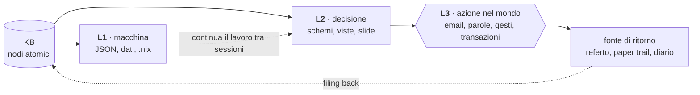
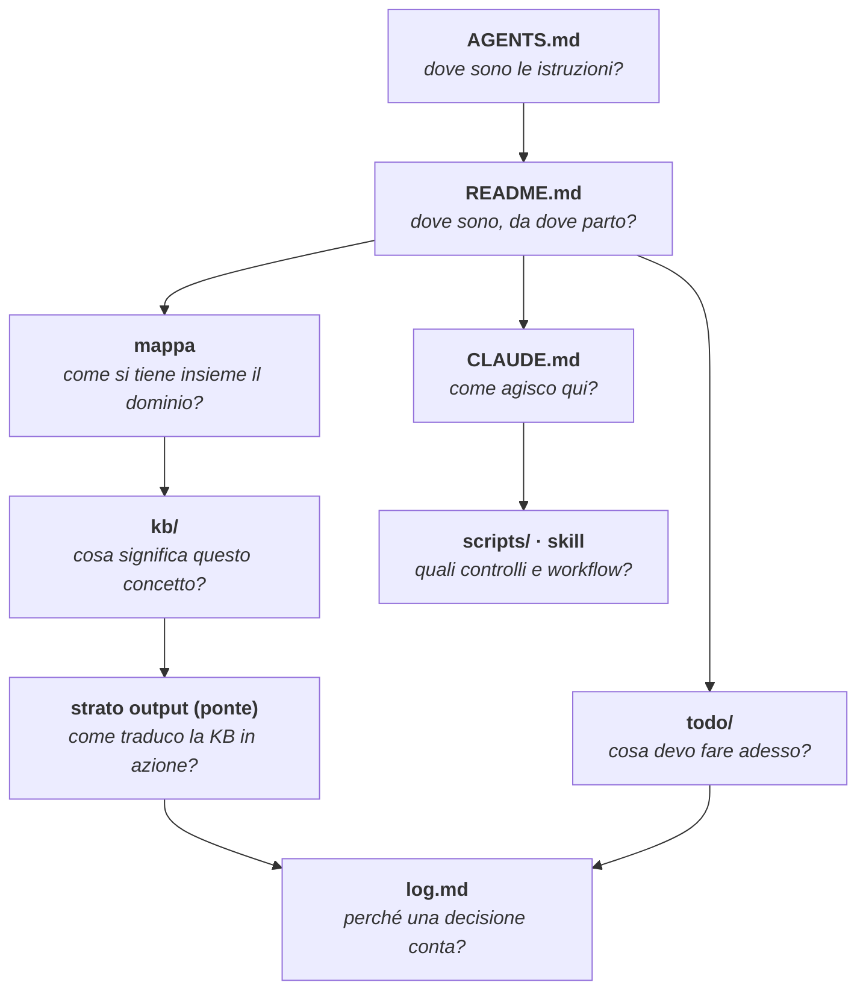
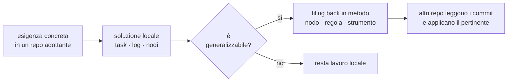
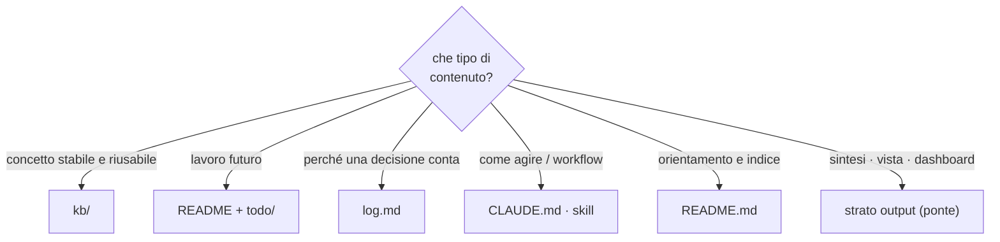

# Il metodo in sintesi

Strato output (L2) del repo `metodo`: la vista d'insieme leggibile a colpo d'occhio del metodo KB. Non è un nodo della KB — è la sintesi che, per la disciplina zettelkastiana, vive nel ponte e non nei nodi atomici. I cinque diagrammi reggono il metodo intero; il dettaglio sta nei nodi linkati in fondo.

## 1. I tre giganti

Tre pilastri che si dividono il lavoro in modo nitido: come è fatto il nodo, chi tiene aggiornato il sistema, come il sistema produce azione.

Karpathy risolve il "chi mantiene" che Luhmann non affronta; Norman risolve il "come l'utente agisce" che né Luhmann né Karpathy affrontano.

## 2. Il ciclo che si chiude attraverso l'azione

La KB non è il fine: è strumentale all'azione. Lo strato output traduce la conoscenza in azione possibile su tre livelli, e l'azione nel mondo ritorna come nuova fonte.

Solo L3 produce effetti reali; L1 e L2 sono strumentali. Senza strato output, la KB accumula conoscenza ma non chiude il ciclo.

## 3. Anatomia di un progetto

La struttura replicabile non è un albero identico: è la presenza esplicita delle funzioni cognitive. Ogni componente risponde a una domanda.

## 4. Sviluppo bottom-up del metodo

Il metodo non si decreta dall'alto: emerge dall'uso reale. `metodo` custodisce le generalizzazioni, non orchestra i repo.

## 5. Dove vive cosa

La regola di routing che tiene puliti i confini tra i componenti.

## Lo strato output di questo repo

Dichiarazione minima del ponte del repo `metodo`, applicata a sé stesso:

- **L1 macchina**: `kb/` in markdown consumato dagli LLM via symlink; output di `scripts/kb_tools.py` (audit JSON/markdown)
- **L2 decisione**: questo file — i cinque diagrammi del metodo in sintesi
- **L3 azione**: il metodo applicato nei quattro repo adottanti (nodi creati, commit, KB mantenute)
- **Fonte di ritorno**: l'osservatorio rilegge i repo adottanti e aggiorna `kb/confronto-progetti-adottanti.md`
- **Criterio di aggiornamento**: quando un gigante, un livello o un componente cambia nei nodi, qui si aggiorna il diagramma corrispondente

## Approfondimento

I diagrammi comprimono; i nodi spiegano.

- tre giganti → `kb/ciclo-azione.md`, `kb/zettelkasten.md`, `kb/pattern-karpathy.md`
- strato output e L1/L2/L3 → `kb/ponte.md`
- anatomia del progetto → `kb/struttura-progetto.md`
- sviluppo bottom-up e osservatorio → `kb/osservatorio-metodo.md`, `kb/metodo-kb.md`
- dove vive cosa → `kb/metodo-kb.md` (regole sullo stato), `kb/zettelkasten.md` (regola pratica)
